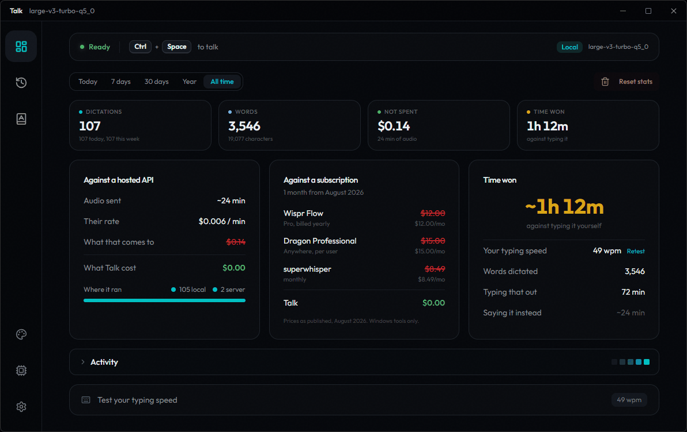

<p align="center">
  
</p>

<h1 align="center">Talk</h1>

<p align="center">
  Hold a key, say the sentence, and it is typed where you were already working.
</p>

<p align="center">
  <a href="https://github.com/avpbynf/Talk-Client/releases"></a>
  
  <a href="LICENSE"></a>
</p>

---

Dictation is faster than typing, and it goes mostly unused because the good engines send
your voice to a company and the ones that run locally mishear every proper noun you care
about. Talk is the third option: your own machine records, your own GPU transcribes, and
the text lands in the window that already had focus. No account, no upload, no tab to
switch to.

<p align="center">
  
</p>
<p align="center">
  <sub>What it opens on: whether the shortcut will work right now, and what it has saved you so far.</sub>
</p>

**Two ways to run it, and the wizard asks on its first screen.** Local loads a Whisper
model on this machine, through whisper.cpp on Vulkan, and needs nothing else: no
network, no server, no account. Server points the app at a
[Talk-Server](https://github.com/avpbynf/Talk-Server) instance instead, which is what
makes a machine with no GPU usable and what lets one card serve several machines from
a single loaded model. Local is the default, and either mode can be changed later on
the Transcription page.

**Server mode carries a fallback**, on unless you turn it off: when the server does not
answer, the local engine takes over mid-shortcut and you keep dictating. Its price is
that a real bug and an unreachable server look identical from the outside, since both
end in the same quiet switch. When transcriptions get worse for no reason, the
Transcription page and the server URL on it are the first place to look.

## Quick start

Take the installer from the [releases](https://github.com/avpbynf/Talk-Client/releases)
page and run it. It asks for no elevation and installs for the current user only.

Coming from a version called T4lk, install straight over it. Windows keys its
uninstall entry on the product name, so a rename would otherwise leave two
applications listed instead of one, and the installer retires the old entry itself.
Settings, history and downloaded models carry over untouched, because the directory
holding them never changed name.

The first launch opens a wizard. It asks for the mode first: local detects the GPU and
downloads a model, server asks for a URL and a token and checks the connection before
moving on. The GGML model is not bundled, so local mode fetches it from HuggingFace on
first use and caches it in AppData, which keeps the installer itself down to a few
megabytes.

Then hold the shortcut and talk.

## What it does

**Recording is a global shortcut**, push-to-talk or toggle, from any window. A small
overlay shows what is being heard, and it can be dragged wherever it is not in the way.

**The text goes in by keystroke or through the clipboard.** Typing it straight into the
focused window is the default and needs no paste. The clipboard route is there for the
applications that refuse synthetic input.

**A vocabulary biases the model toward your words.** Product names, colleagues,
libraries, anything Whisper would otherwise turn into the nearest common word. It is a
plain list, typed once.

**History is local and searchable**, capped so it does not grow forever, and the
statistics page reads from it: how much you dictated, how much time that saved against
typing it, and where it went.

**On a machine with two graphics cards, you say which one works.** Which card comes
first depends on the driver and on what Windows was told to prefer, so Talk takes the
discrete one rather than the first one, and the Transcription page lists them by name to
change that. Memory alone would not decide it: an integrated chip reports the shared
system memory as its own and comes out ahead of a discrete card carrying half as much of
its own. The model reloads on the card you pick, without restarting the app.

**Meeting mode routes the microphone through VB-Cable**, so a call keeps hearing you
while Talk captures the same input. Everything the machine plays can be turned down for
the length of a recording, to a share of where it already was, and put back at the stop
rather than after the transcription.

**It updates itself from the releases page.** Shortly after launch, then once an hour
for a window left open, it asks GitHub what the newest release is. A strip under the
titlebar offers to install it, and installing runs the same installer you would have
downloaded by hand, closes the window and opens it again. The Preferences page carries
the version that is running and a button that asks straight away. Nothing installs
unless it was signed by the key the release was built with, and a version installed
before any of this existed has to be replaced by hand once.

It starts with Windows and lives in the tray, if you want it to.

## Building

Windows only. The native side compiles whisper.cpp from source, so budget a long first
build.

| Requirement | Why | Get it |
|---|---|---|
| Rust 1.90 | pinned by `src-tauri/rust-toolchain.toml` | [rustup.rs](https://rustup.rs) |
| Bun | frontend package manager and task runner | [bun.sh](https://bun.sh) |
| Visual Studio 2022 | the "Desktop development with C++" workload, Community or Build Tools | [visualstudio.microsoft.com](https://visualstudio.microsoft.com/downloads/) |
| CMake | whisper.cpp is a CMake project | [cmake.org](https://cmake.org/download/) |
| Ninja | the generator `.cargo/config.toml` asks for | [ninja-build.org](https://ninja-build.org) |
| LLVM | `whisper-rs-sys` generates its bindings with bindgen, which loads `libclang.dll` | [releases.llvm.org](https://releases.llvm.org) |
| Vulkan SDK | only for the default `vulkan` feature | [vulkan.lunarg.com](https://vulkan.lunarg.com/sdk/home) |

All but Visual Studio come from winget, which is quicker than seven download pages:

```bash
winget install Rustlang.Rustup Oven-sh.Bun Kitware.CMake Ninja-build.Ninja LLVM.LLVM KhronosGroup.VulkanSDK
```

```bash
bun install
bun run tauri:dev
```

`bun run tauri:build` produces the installer, and `bun run tauri:check` runs `cargo
check` without a full build. Use the `tauri:` scripts rather than calling `tauri`
directly: they go through `scripts/vcenv.bat`, which loads the MSVC environment CMake
needs.

To build without a GPU backend, and skip the Vulkan SDK entirely, drop the default
feature:

```bash
cargo build --manifest-path src-tauri/Cargo.toml --no-default-features
```

### When the build fails

- **`cl.exe` not found.** The MSVC environment was not loaded. Run the `bun run tauri:`
  scripts rather than calling `tauri` directly.
- **A bindgen panic about `libclang`.** LLVM is not installed, or not where bindgen
  looks. Install it, or point `LIBCLANG_PATH` at the directory holding `libclang.dll`.
  The panic names no file of this project, which makes it read like a broken dependency.
  It is not one.
- **A path that is too long.** `vulkan-shaders-gen` nests its own build tree around 220
  characters deep, and the default target directory sits under the checkout, so the two
  together cross the Windows limit. MSBuild says so plainly, as `MSB4184` naming a path
  it cannot normalise. CMake, reached the same way, instead claims the C compiler cannot
  build a trivial program. Point the build somewhere short, which is what CI does:

  ```bash
  CARGO_TARGET_DIR=C:\rust-target bun run tauri:build
  ```

  The deepest file the build writes sits 219 characters below that directory, so
  anything up to about 40 characters works and a path under `Documents` does not.
  Moving the checkout helps too, but the target directory is the half that grows.
- **Meeting mode reports VB-Cable missing.** The app detects
  [VB-Audio Virtual Cable](https://vb-audio.com/Cable/) by enumerating audio devices,
  and the NSIS installer is what installs the driver. A source build, or a declined
  prompt, leaves you without it: install it by hand and restart the app.

### Building the installer

`bun run tauri:build` runs `src-tauri/nsis-hooks.nsh`, which ships the contents of
`src-tauri/resources/VBCABLE_Driver/` and runs `VBCABLE_Setup_x64.exe` at install time.
Those driver binaries are not in the repository, since VB-Audio redistributes them under
its own terms: fetch the package from [vb-audio.com](https://vb-audio.com/Cable/) and
unpack it there before building an installer. Everything else builds without them.

The two bitmaps the wizard displays are committed next to the icons, and rebuilt by
`python scripts/make-installer-images.py` whenever the mark or the wordmark changes.

Uninstalling reclaims the model cache, which is the only part worth a gigabyte, and
leaves `settings.json` and the history where they are so a reinstall finds them.

### The signing key

Every installer is signed, since an installation only accepts an update signed by the
private half of the key whose public half is in `tauri.conf.json`. `tauri build` reads
that key from `TAURI_SIGNING_PRIVATE_KEY`, either the key itself or the path to the
file holding it, and its password from `TAURI_SIGNING_PRIVATE_KEY_PASSWORD`. Both are
repository secrets on CI; a local build needs them in the environment, and fails
without them rather than producing an installer nobody could update to.

Keep the key: signing with a new one strands every installation out there, since none
of them would accept it and every user would have to install by hand again.

## Licence

MIT, see [LICENSE](LICENSE).
